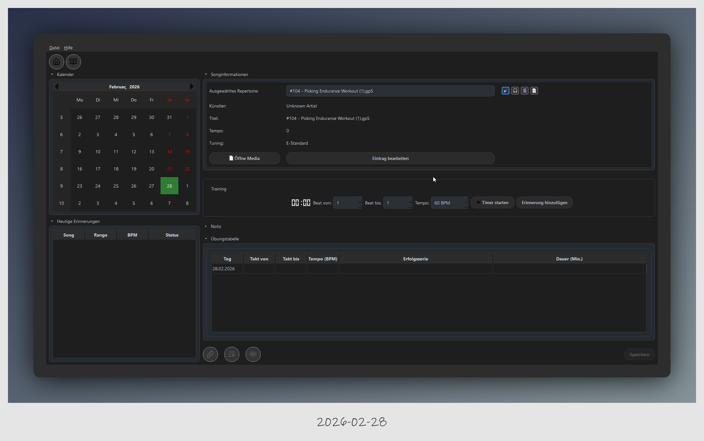
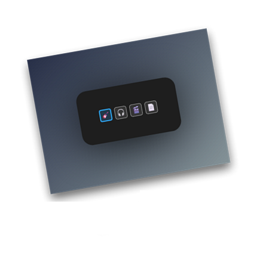
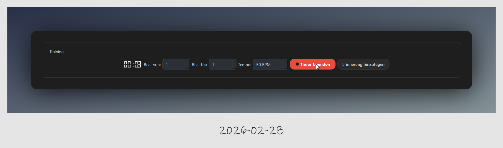
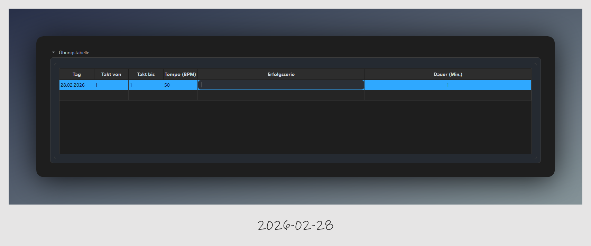
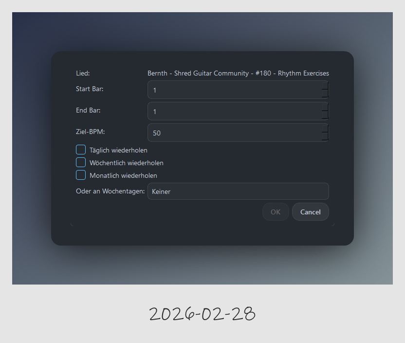
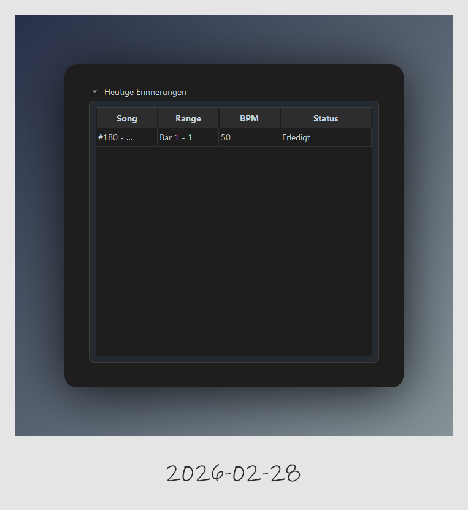
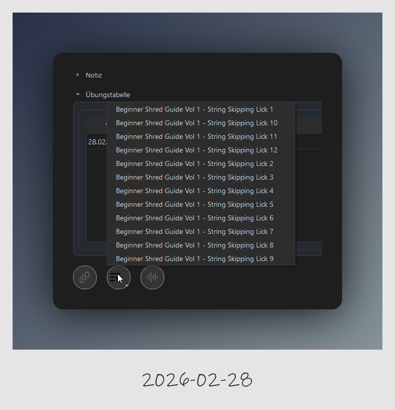
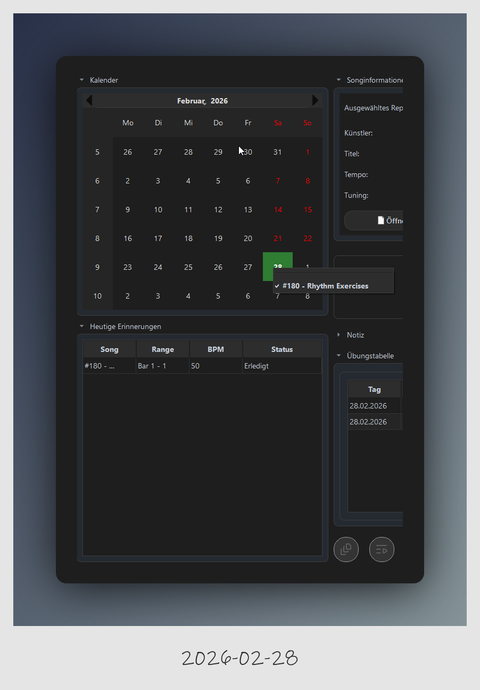

# Das Übungs-Dashboard

Das Dashboard ist deine zentrale Schaltstelle. Hier verwaltest du dein Repertoire, startest Übungseinheiten und trackst deine Fortschritte.

### 1. Songinformationen und Medien-Selector

Oben im Dashboard siehst du alle Details zum aktuell gewählten Song (Künstler, Titel, Tempo, Tuning).

#### Die Suchfilter (Icons oben rechts)

Die vier farbigen Icons dienen **ausschließlich als Filter** für den Medien-Selector:

* **Gitarre**: Filtert nach Guitar Pro Dateien. (Stanard aktiviert beim Start der Anwendung)

* **Kopfhörer**: Filtert nach Audio-Dateien.

* **Filmklappe**: Filtert nach Videos.

* **Dokument**: Filtert nach Dokumenten/Bildern (PDF, JPG, PNG).

**Wichtig:** Diese Icons öffnen keine Dateien. Sie steuern lediglich, welche Dateitypen in der Suchliste erscheinen.

---

### 2. Training und Zeitmessung

Im Bereich **Training** bereitest du deine Session vor:

* **Takt-Bereich**: Lege fest, von welchem bis zu welchem Takt du üben möchtest.

* **Tempo**: hier kannst du ein Tempo für deine Session festlegen. Die hoch runter Pfeile gehen in 5 er Schritte nach oben oder runter, gezielte Zahl wie 62 müssen mit der Tastatur eingegeben werden.

* **Timer**: Klicke auf **Timer starten**, um deine Netto-Übungszeit zu erfassen. Der Button färbt sich rot, solange die Zeit läuft.

* **Erinnerung**: Mit "Erinnerung hinzufügen" planst du die Übung für die Zukunft ein.

#### Der Übungsprozess: Tracking & Erfolgsserie

Sobald du deine Übungseinheit beendest, protokolliert SonarPractice deinen Fortschritt automatisch in der Übungstabelle.

**Automatisches Protokoll**

Durch Klicken auf den Button **Timer beenden** werden die wesentlichen Daten deiner Session sofort in die Tabelle übertragen:

- Zeitstempel: Das aktuelle Datum der Einheit.

- Bereich: Die geübten Takte ("Takt von/bis").

- Tempo: Die eingestellte Geschwindigkeit in BPM.

- Dauer: Die exakte Netto-Übungszeit in Minuten.

- Das Feld "Erfolgsserie", hier kannst du deine Fehlerfreie Serie eintragen (fehlerfreie Wiederholungen). Man sagt, erst wenn man 7 Fehlerfreie Wiederholungen am stück gemeistert hat, ist es tief im Kopf verankert und man kann zur nächsten höheren Stufe welchseln. 

!!! danger "Achtung: Datenverlust bei Songwechsel"
    Ein Songwechsel verwirft deine aktuelle Übungssitzung. Wenn du den Song wechselst, bevor du gespeichert hast, geht die Session verloren (derzeit erfolgt noch keine Warnmeldung durch das Programm).

---

### 3. Erinnerung anlegen!

Über den Button **"Erinnerung hinzufügen"** kannst du gezielt für eine Session erinnerungen definieren. 

Derzeit steht zur Auswahl was du üben möchtest, also von Takt bis Takt und auf welcher BPM. Damit du einen Individuellen Lernplan für dich erstellen kannst, kannst du gezielt auswählen wann die nächste Übe-Session geplant hast. 

* **Tägliche** Wiederholung

* **Wöchentliche** Wiederholung

* **Monatliche** Wiederholung

* Du kannst auch **einen Wochentag** auswählen, wennst du diese Übung an einen bestimmten Wochentag üben möchtest.

Das System erkennt sofort ob eine Session erledigt ist und zeigt diese im Erinnerung Tabelle an. Es werden nur die heutigen Erinnerungen angezeigt. Ein Rechtsklick auf eine Erinnerunge öffnet ein Kontextmenü, darüber kannst du die Übe Session Laden, Editieren, Medien öffen oder die Erinnerung komplett löschen.

---
### 4. Schnellzugriff auf verknüpfte Medien

Unter der Übungstabelle befinden sich die runden Icons für den **direkten Zugriff**:

* **Medien öffnen**: Klicke auf diese Icons, um verknüpfte Dateien sofort zu starten.

* **Auswahllisten**: Sind einem Song mehrere Dateien des gleichen Typs zugeordnet (z. B. verschiedene Licks eines Kurses), öffnet sich ein Dropdown-Menü zur Auswahl.

---

### 5. Fortschrittskontrolle (Kalender & Reminder)

* **Kalender**: Tage mit Übungsaktivität werden grün markiert. Ein Tooltip zeigt dir beim Überfahren per Maus an, was du an diesem Tag geübt hast. Darüber kannst du auch ganz einfach disesen Eintrag laden um nicht den weg über den Medien Selektor gehen zu müssen.

Unter dem Kalender findest du den Reminder, der Reminder zeigt dir deine Heutigen geplanten Übungen an.
Sobald du eine Übung gemacht hast, wird diese sofort als Erledigt markiert.

