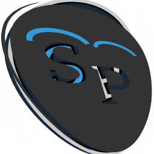

# Willkommen bei SonarPractice

[SonarPractice herunterladen (Windows) ](https://knasan.github.io/sonarpractice/download/SonarPractice_Web_Setup.exe){ .md-button .md-button--primary }

Aktuelle Version: Lädt...

SonarPractice ist aus einem ganz persönlichen Bedürfnis entstanden: Als Gitarrist suchte ich nach einem Weg, meinen Lernfortschritt präzise festzuhalten. Zettelwirtschaft ist unübersichtlich und Tabellenkalkulationen stießen schnell an ihre Grenzen.

Die Lösung ist eine **lokale Datenbank** – sicher, privat und ohne Registrierungszwang.

## Was SonarPractice für dich tut

Das Tool unterstützt dich dabei, dein Üben zu strukturieren und dein System sauber zu halten:

**Tracking & Journaling:**
Halte deine Übungserfolge und täglichen Fortschritte am Instrument fest.

**Kurs-Management:**
Organisiere unterschiedliche Dateiformate (Guitar Pro, PDF, Audio, Video) an einem zentralen Ort.

**System-Hygiene:** Finde defekte Dateien und bereinige Dubletten mit intelligenter Hash-Analyse.

### Der "Perfect Practice" Workflow

Um das Beste aus SonarPractice herauszuholen, wird folgender Ablauf empfohlen:

**Auswahl:** Wähle eine Übung über die Bibliothek. Du kannst hier direkt auf verknüpfte PDFs oder Audios zugreifen.

**Vorbereitung:** Starte die Datei in deinem Standardprogramm (z. B. Guitar Pro) und bereite Takte und Tempo vor.

**Fokus-Modus:** Wechsle zu SonarPractice und klicke auf Start Timer.

**Erfassung:** Nach der Session klicke auf Timer beenden. Einstellungen wie Takt von/bis, BPM und Dauer wird automatisch übernommen.

**Reflexion:** Nutze die Notiz-Funktion für Journaling-Fragen wie "Was fiel mir leicht? Was nicht?", um dein Mindset für morgen zu stärken.

### Community & Open Source

SonarPractice ist ein Open-Source-Projekt, das von der Community lebt. Deine Hilfe ist willkommen, egal ob du Musiker, Designer oder Entwickler bist:

**Tester:** Melde Fehler oder Usability-Probleme.

**Ideengeber:** Welches Feature fehlt dir im täglichen Workflow? 

**Entwickler:** Beteilige dich direkt am Code via Pull Requests.

[Besuche das Projekt auf GitHub](https://github.com/knasan/sonarpractice)

### Erste Schritte
Bist du bereit? Dann starte mit der [Installation](installation.md) oder schau dir an, wie du deine erste [Konfiguration](konfiguration.md) durchführst.
