# Installation von SonarPractice

Diese Anleitung führt dich durch die Installation der aktuellesten Beta.

## Der Installationsassistent

Folge den Schritten des Assistenten, um die Anwendung auf deinem System einzurichten.

### Installation unter Windows (SmartScreen)

Da SonarPractice ein unabhängiges Open-Source-Projekt ist, wird die Installationsdatei aktuell noch nicht von einem kostenpflichtigen Microsoft-Zertifikat begleitet. Windows zeigt daher beim ersten Start eine Warnmeldung an.

So setzt du die Installation fort:

Klicke im blauen (oder grauen) Fenster auf "Weitere Informationen".

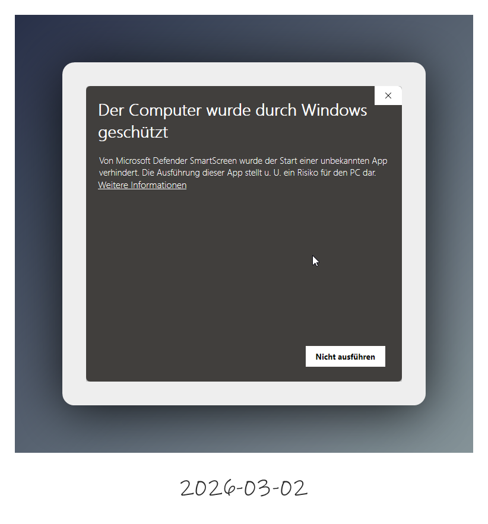

Wähle anschließend den Button "Trotzdem ausführen".

Keine Sorge: Die Software enthält keine schädlichen Funktionen. Die Warnung resultiert lediglich aus dem fehlenden (sehr kostspieligen) Zertifikat für kleine Entwickler.

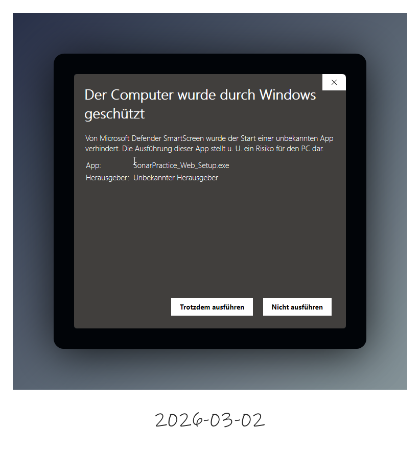

---

### Schritt 1: Willkommen

Beim Start des Installers wirst du vom Einrichtungsassistenten begrüßt. Klicke auf **Weiter**, um fortzufahren.

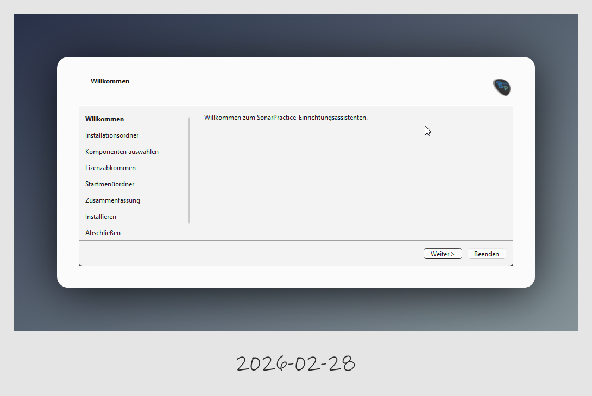

---

### Schritt 2: Information
Hier findest du Informationen zur aktuellen Version, Links zum GitHub-Projekt und die Möglichkeit, das Projekt zu unterstützen.

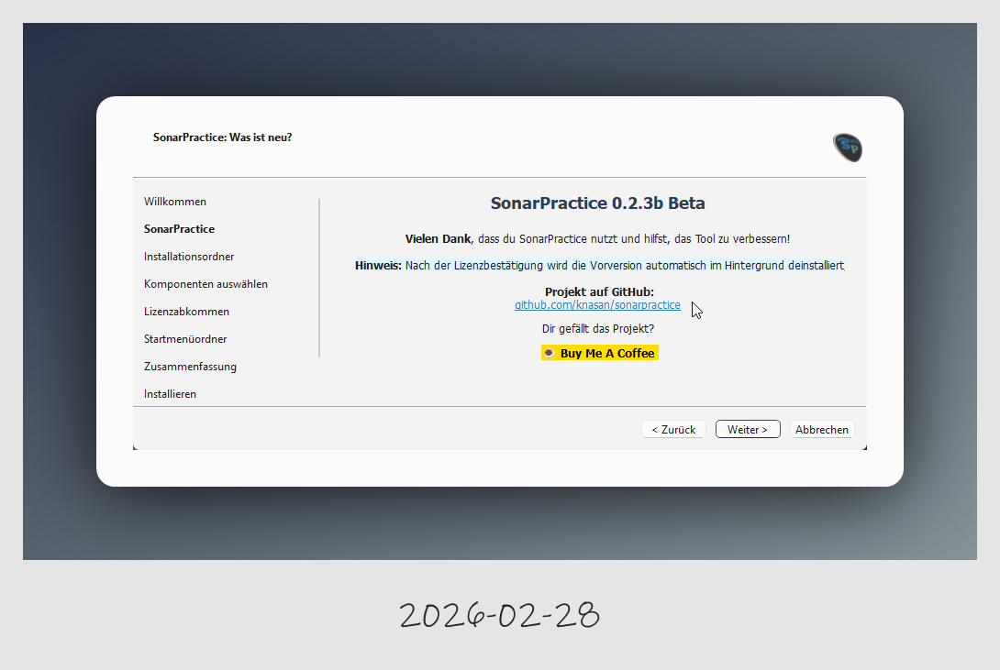

---

### Schritt 3: Installationsordner
Wähle das Verzeichnis aus, in dem SonarPractice installiert werden soll. Der Standardpfad ist `C:\Program Files\SonarPractice`.

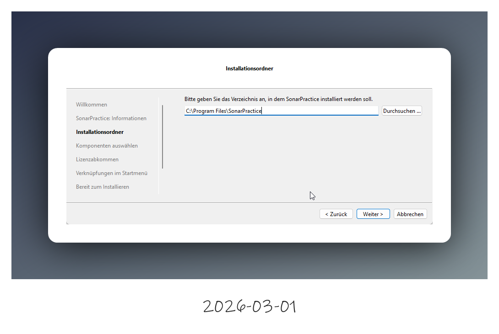

---

### Schritt 4: Komponenten auswählen
In diesem Schritt kannst du festlegen, welche Bestandteile installiert werden sollen. Du siehst hier auch den erforderlichen sowie den verfügbaren Festplattenplatz.

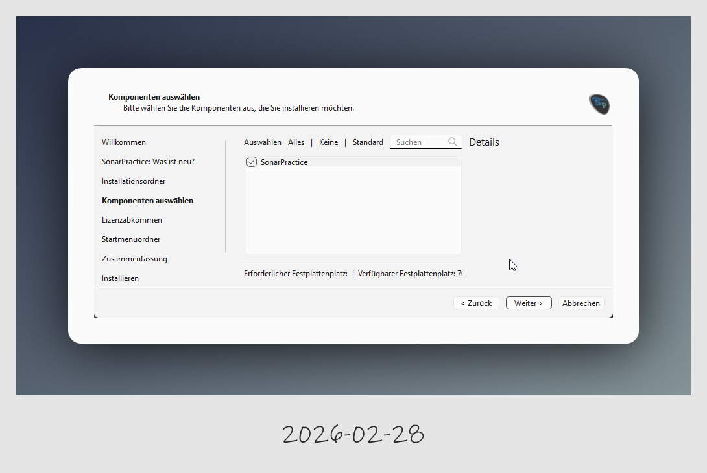

---

### Schritt 5: Lizenzabkommen
Lies dir die GNU General Public License (GPL v3) durch. Du musst die Bedingungen akzeptieren, um mit der Installation fortzufahren.

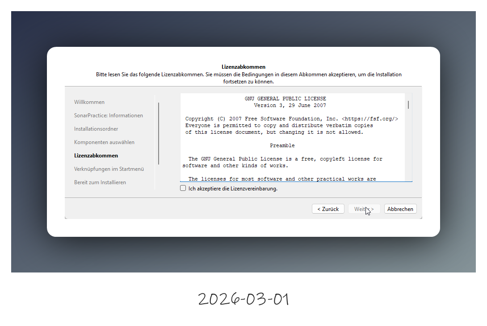

---

### Schritt 6: Startmenü-Ordner
Wähle den Namen für den Ordner im Startmenü aus, unter dem die Verknüpfungen angelegt werden.

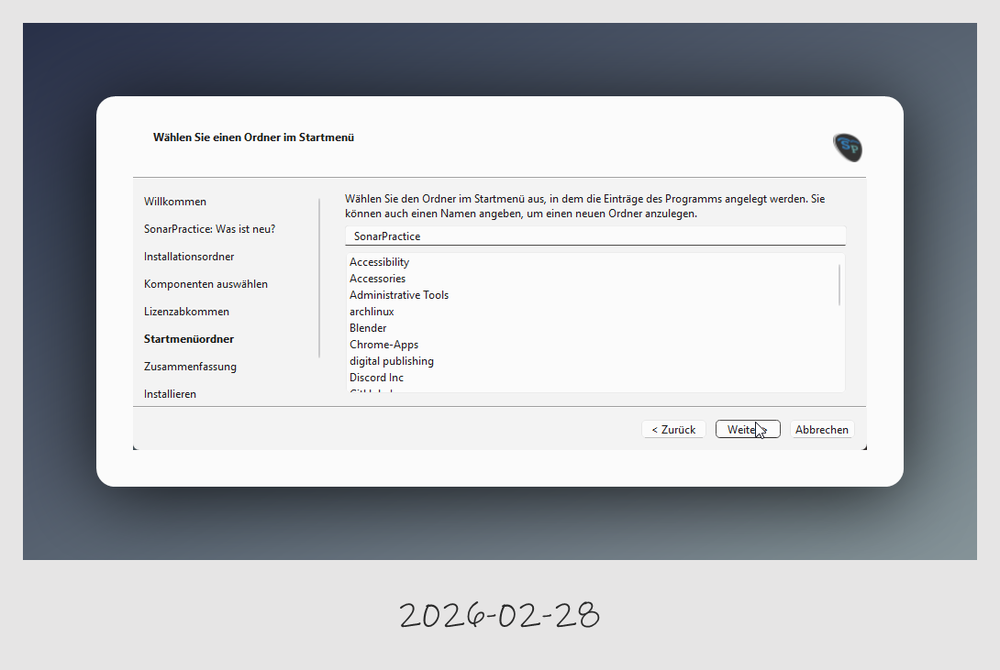

---

### Schritt 7: Zusammenfassung
Bevor die Dateien geschrieben werden, erhältst du eine Übersicht über die geplante Installation. Für die Kernanwendung werden ca. 102 MB benötigt.

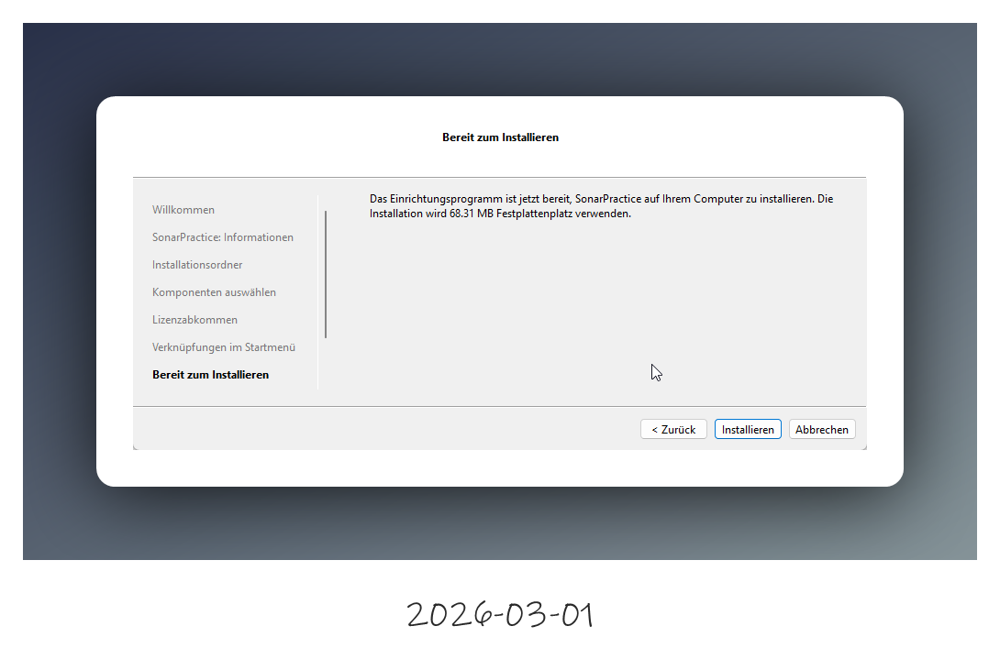

---

### Schritt 8: Fortschritt
Der Installationsvorgang wird gestartet. Ein Balken zeigt dir den aktuellen Fortschritt der Komponenten-Installation an.
Der Installer holt sich aus dem Internet die aktuellste version.
Du benötigtst diesen Installer nicht mehr nach der Installation, das installierte maintenancetool.exe in `%ProgramFiles%/SonarPractice/maintenancetool.exe` kann das Programm immer aktualisiern.

Seit Version 0.2.6 ist das Update über das Menü Hilfe->Update verfügbar.

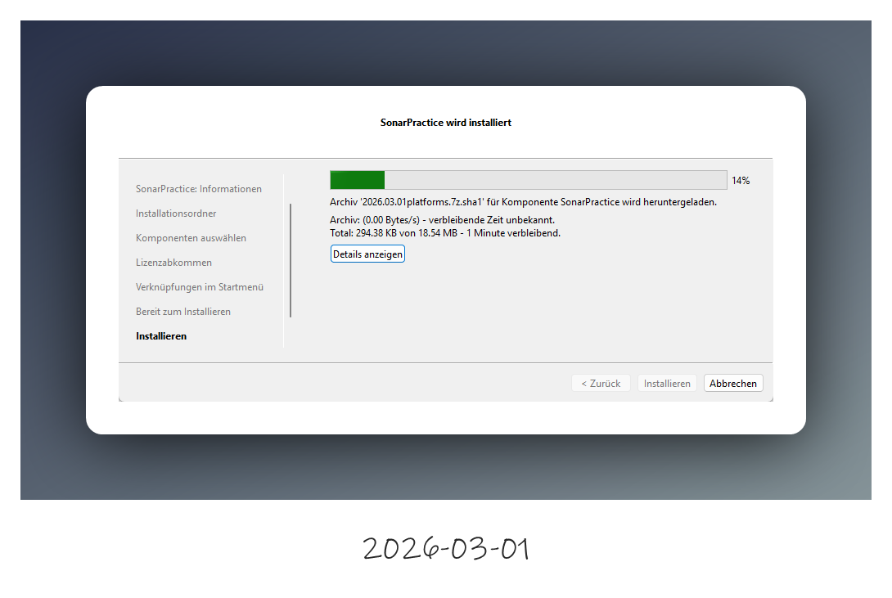

---

### Schritt 9: Abschluss
Nach erfolgreicher Installation kannst du den Assistenten schließen. Aktiviere das Häkchen bei **SonarPractice jetzt starten**, um direkt mit der Konfiguration zu beginnen.

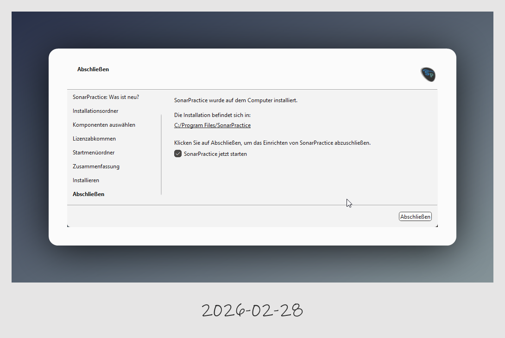
