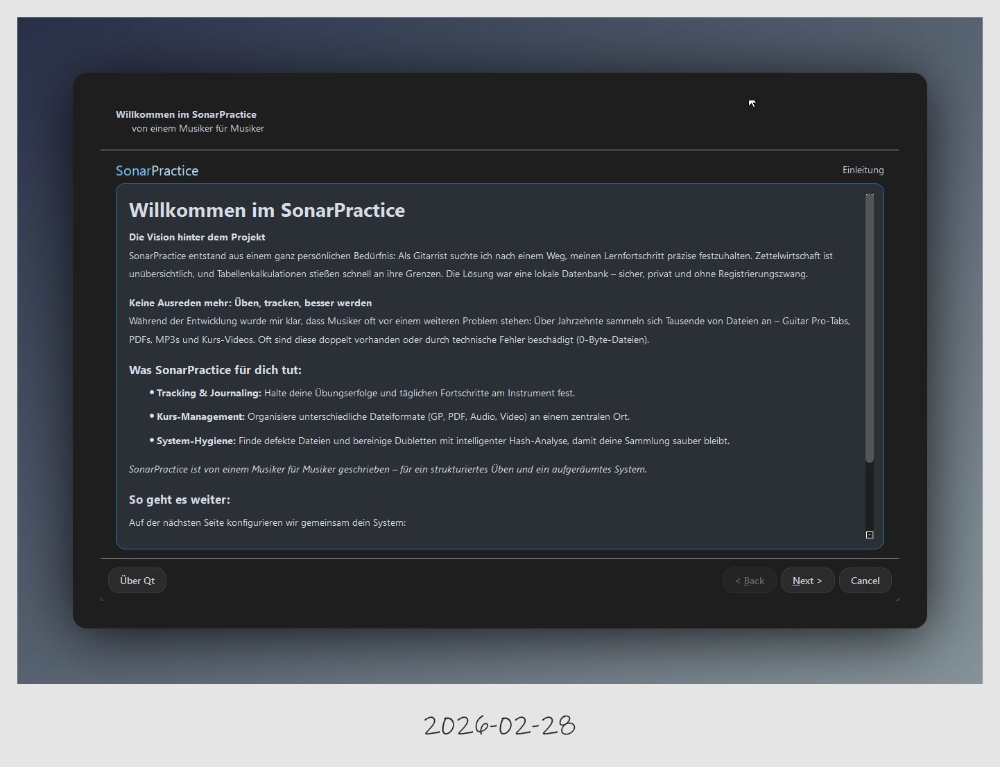
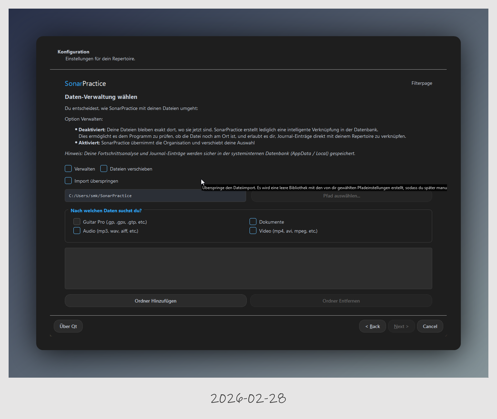
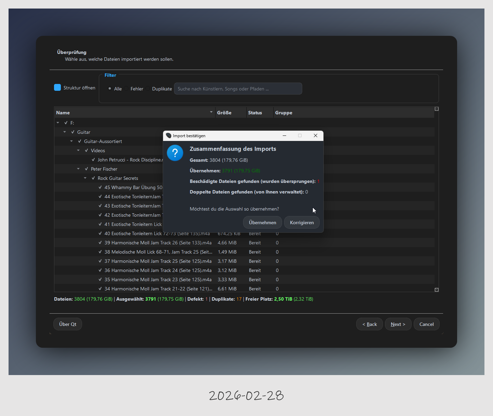
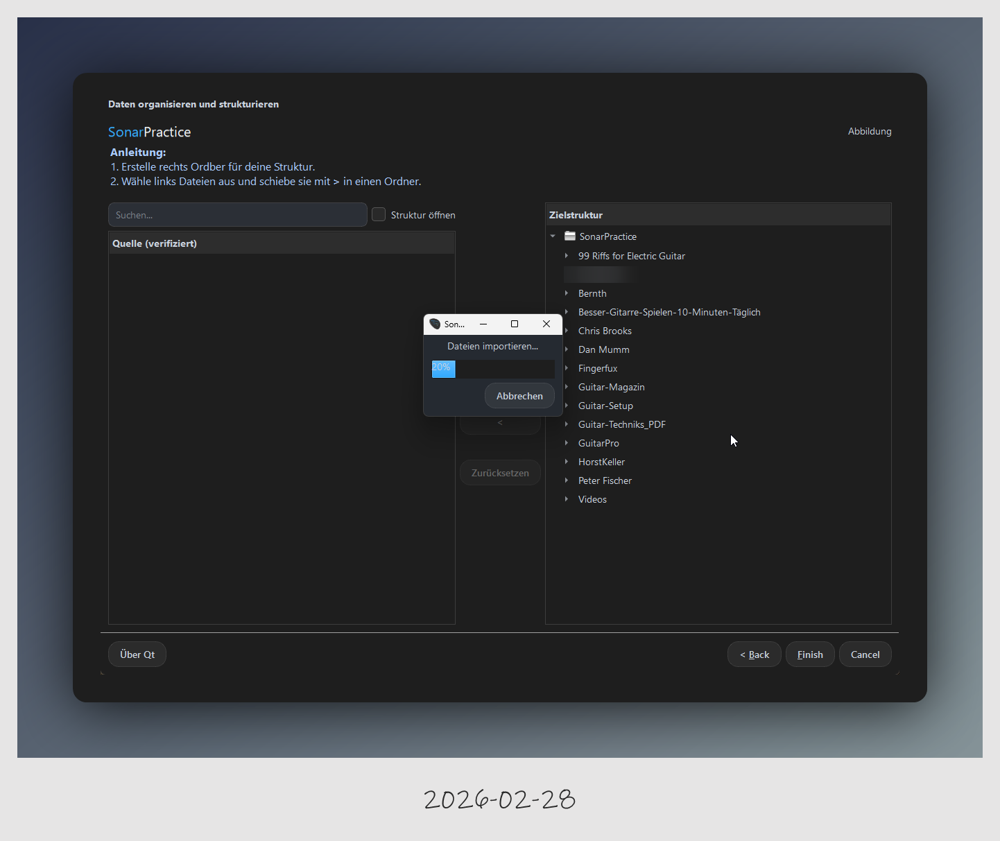

# Erstkonfiguration und Datenimport

Nachdem die Installation abgeschlossen ist, führt dich SonarPractice durch die Ersteinrichtung deiner Repertoire-Datenbank.

### 1. Willkommen und Vision
Beim ersten Start stellt sich das Projekt vor. Der Fokus liegt auf einer privaten, lokalen Datenbank ohne Registrierungszwang, um deine Übungsfortschritte präzise festzuhalten.

---

### 2. Daten-Verwaltung wählen
In diesem Schritt entscheidest du, wie SonarPractice mit deinen Dateien umgeht:

* **Deaktiviert (Standard)**: Das Programm erstellt nur Verknüpfungen. Deine Dateien bleiben an ihrem Originalort.

* **Aktiviert (Dateien kopieren)**: Das Programm übernimmt die physische Organisation deiner Dateien. Kopiert aber nur die deine Dateien.

* **Dateien verschieben**: Wenn Dateien Verschieben aktiviert ist, dann werden die Dateien nicht einfach kopiert sondern ein dein Zielverezeichnis verschoben. 

* **Import überspringen**: Diese Option kann interessant sein wenn du eine sehr großes Repertoire hast und deine Datein gezielt übernehmen möchtest. Wenn du dein Material schirttweise Importieren möchtest, hast du den Vorteil später im Bibliothek Manager die passenden Dateien schneller zu finden. Wenn du nur ein paar Hundert Dateien hast, kannst du jedoch alles Importieren. 

* **Suchfilter**: Wähle hier gezielt aus, nach welchen Dateitypen (Guitar Pro, Audio, Video oder Dokumente wie JPG/PNG) dein System gescannt werden soll.

---

### 3. Dateiscan und Überprüfung
Das System scannt nun die gewählten Ordner und gibt dir eine detaillierte Übersicht über den Status:

* **Statusprüfung**: Dateien werden auf Defekte oder Duplikate geprüft.
* **Statistiken**: Du siehst das Gesamtvolumen deines Repertoires (z. B. 179 GiB) und die Anzahl der verifizierten Dateien.

---

### 4. Daten organisieren und strukturieren
Dies ist der letzte Schritt vor dem eigentlichen Training. Hier baust du deine Zielstruktur auf:

1.  **Zielstruktur erstellen**: Erstelle auf der rechten Seite Ordner für deine Kurse oder Kategorien.
2.  **Dateien zuordnen**: Wähle links die verifizierten Quelldateien aus und schiebe sie mit der **`>` Taste** in deine neue Ordnerstruktur.
3.  **Abschluss**: Klicke auf **Finish**, um den Importvorgang zu starten und die Datenbank final anzulegen.

