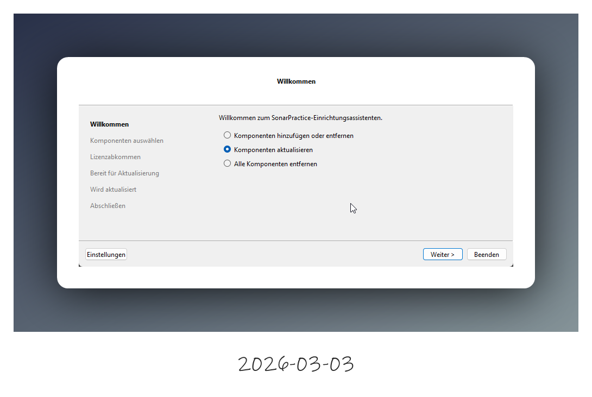
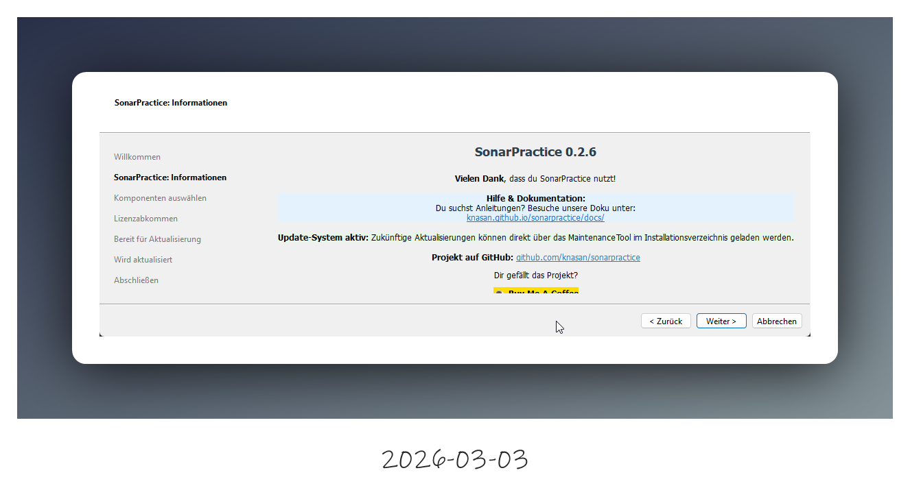
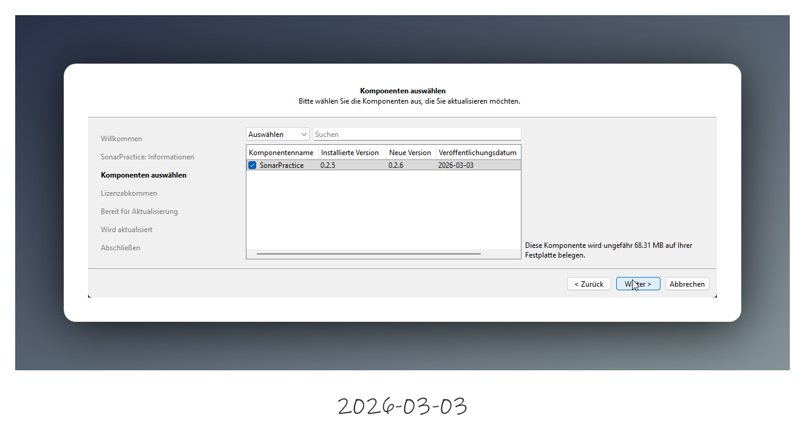
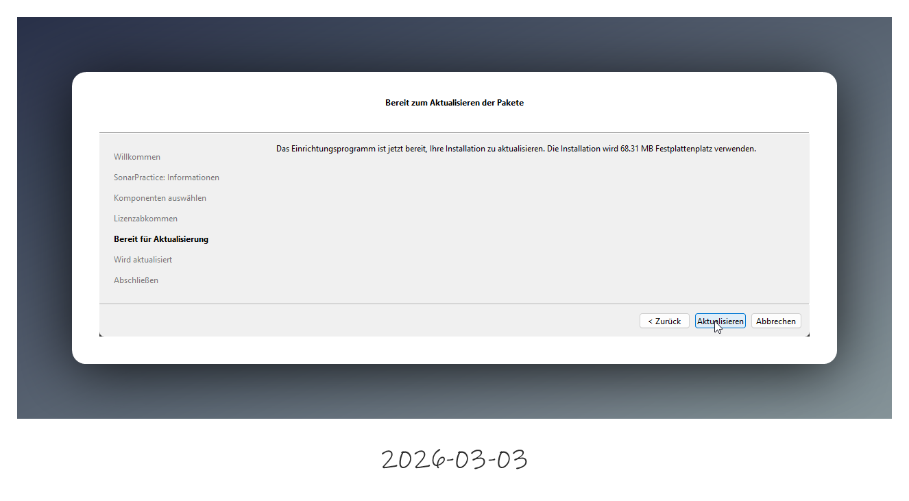
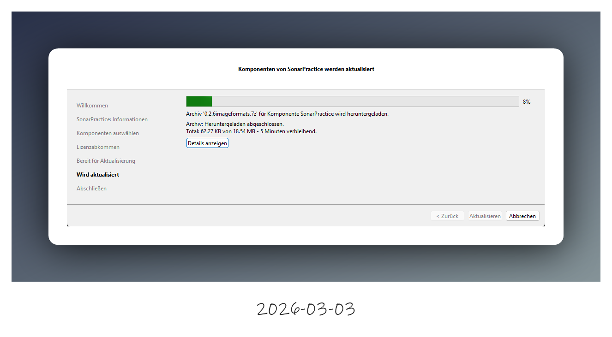
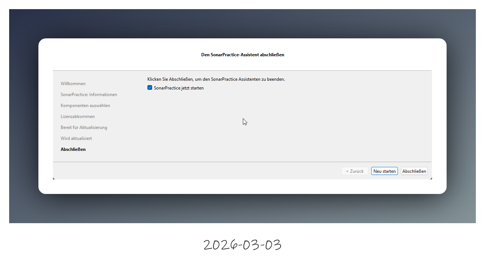

## Update

Über das Menu Hilfe->Update öffnet sich das mitgelieferte maintenancetool im Update Modus.

Wenn eine neue Version von SonarPractice verfügbar ist, unterstützt dich der Einrichtungsassistent bei der Aktualisierung.

Bei der Ausführung des Installers stehen dir drei Optionen zur Verfügung. Da die Software als kompaktes Paket geliefert wird, ist die wichtigste Option bereits für dich vorbereitet:

Komponenten aktualisieren: Diese Option ist standardmäßig vorausgewählt. Klicke einfach auf Weiter >, um die neueste Version zu installieren. Deine Einstellungen und Daten bleiben dabei erhalten.

Komponenten hinzufügen/entfernen: Aktuell nicht relevant, da alle Funktionen in einem Hauptmodul gebündelt sind.

Alle Komponenten entfernen: Wähle dies nur, wenn du SonarPractice vollständig von deinem System löschen möchtest. Deine Datenbank wird jedoch nicht mit entfernt. Du findest die Datenbank unter `%ProgramFiles%/SonarPractice` wenn du den installationspfad nicht verändert hast.

Wir freuen uns über jedes Feedback zu SonarPractice! Egal ob Lob, Kritik oder neue Ideen – lass es uns wissen. Da SonarPractice ein Open-Source-Projekt ist, ist jede helfende Hand und jede Meinung herzlich willkommen. Werde Teil der Community!"

Das Maintenance Tool zeigt hier dir nochmal an, welche Version derzeit auf dem Server verfügbar ist. 

Wie bei er erstinstallation, siehst du hier wie viel freien Speicherplatz die Installation benötigt.

Aus unser Repository wird nun die aktuelle Version heruntergelanden und installiert.

Nach abschluss der Installation hast du die möglichkeit SonarPractice zu starten.

Geschafft, die neue installation von SonarPractice wurde Installiert.
Klicke auf Abschließen um das Update zu beenden.

 "Teile deine Fortschritte"
    
    Wir hoffen, dass SonarPractice ein wertvoller Begleiter ist und wünschen dir viel Erfolg beim Üben deines Instruments. 
    
    Lass uns gerne ein YouTube-Video oder eine Nachricht auf Facebook da, die SonarPractice in Aktion zeigt – das würde uns sehr helfen und wir schätzen dies sehr!

